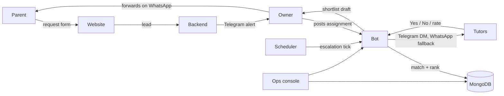

# LionCity Tutors

The platform behind [LionCity Tutors](https://www.lioncitytutors.com), a Singapore tuition agency. Parents
request a tutor on the website; the system matches the request against the tutor database, reaches
out to the best-ranked tutors in waves over Telegram and WhatsApp, and hands the owner a shortlist
to send to the parent. The goal is a parent-ready shortlist within hours, without anyone working
through spreadsheets.

## How it works



1. **Intake.** A parent fills in the request form. The owner posts the assignment through the
   Telegram bot, which shows a budget check: how many tutors the rate can afford and the typical
   market range for that level.
2. **Matching.** Tutors are hard-filtered on level, subject, region, tutor type, budget, timing and
   availability, then ranked on experience, education, profile quality, budget fit, track record
   and reply history. Profile quality is a 1–5 grade that Gemini extracts once, when a tutor
   registers or edits their profile, so ranking itself makes no LLM calls.
3. **Outreach.** Wave 1 goes out as soon as the assignment is posted. Tutors with a linked Telegram
   account get a free DM; everyone else gets a WhatsApp template through the Meta Cloud API. A
   scheduled tick sends further waves, sized from the recent interest rate, until enough tutors
   say yes or the pool runs out.
4. **Replies.** Tutors tap Yes or No (typed replies are parsed too). Interested tutors are asked
   for their rate for this assignment; decliners are asked why. Anything the bot can't classify is
   forwarded to the owner's Telegram, and the owner can reply from there.
5. **Shortlist.** After a short hold window the interested tutors are re-ranked and the best are
   drafted into a parent message. Parents are never messaged automatically: the owner gets a
   one-tap WhatsApp link with the draft filled in.
6. **After the match.** A placement is recorded when the parent picks a tutor, and the owner is
   prompted for a check-in around day 30. Every ranking decision is logged with its inputs, so the
   ranking can be tuned against real outcomes.

The **ops console** (`/ops` on the website, password-protected) is the owner's mobile workspace:
a queue of assignments that need attention, a per-assignment breakdown of who was contacted and
why, one-tap recovery for stalled outreach (widen region, raise budget, relax tutor type), the
check-in queue, and weekly health metrics.

## Repository layout

```
apps/
  website/        Next.js 14 site: parent pages, subject guides, request form, tutor sign-up, ops console
  backend/        Express API that receives website forms and alerts the owner
  telegram-bot/   Bot, matching and outreach, deployed as Vercel functions
    api/          HTTP entry points: Telegram + WhatsApp webhooks, escalation tick, console actions
    bot/          Telegram command and callback handlers
    utils/        Matching, ranking, outreach, reply parsing, profile extraction
    scripts/      Maintenance and inspection scripts (dry run by default)
packages/
  shared/         Mongoose models (Tutor, Assignment, Placement, Recommendation) and shared utilities
```

## Tech stack

- **Website:** Next.js 14 (app router), React 18, Tailwind CSS
- **Bot:** Node.js on Vercel serverless functions, node-telegram-bot-api, Meta WhatsApp Cloud API,
  Google Gemini (`@google/genai`) for profile extraction
- **Backend:** Express
- **Data:** MongoDB with Mongoose; models are shared across all three apps through `packages/shared`
- **Monorepo:** npm workspaces

## Running locally

Requires Node.js 20+ and a MongoDB connection string.

```bash
npm install
npm run dev:website     # http://localhost:3000
npm run dev:backend     # http://localhost:4000
npm run dev:all         # both
```

The bot has no long-running process: each file in `apps/telegram-bot/api/` is a Vercel function.
Run them locally with `vercel dev` from `apps/telegram-bot`, and point the Telegram and WhatsApp
webhooks at a tunnel to test end to end.

### Environment variables

Each app reads its own env file (`apps/website/.env.local`, `apps/backend/.env`,
`apps/telegram-bot/.env`). Never commit them. The main ones:

| Variable | Used by | Purpose |
| --- | --- | --- |
| `MONGODB_URI` | all | Database connection |
| `BOT_TOKEN`, `BOT_USERNAME`, `ADMIN_USERS` | bot, website | Telegram bot and the owner's admin IDs |
| `WHATSAPP_PHONE_NUMBER_ID`, `WHATSAPP_ACCESS_TOKEN` | bot | Sending through the WhatsApp Cloud API |
| `WHATSAPP_WEBHOOK_VERIFY_TOKEN`, `WHATSAPP_APP_SECRET` | bot | Webhook handshake and request signature check |
| `WHATSAPP_API_KEY` | bot, website | Shared key the website uses to call the bot's API |
| `GEMINI_API_KEY` | bot | Profile extraction |
| `BOT_API_URL`, `OPS_PASSWORD`, `OPS_SESSION_SECRET` | website | Ops console |
| `NEXT_PUBLIC_BACKEND_URL` | website | Where the request form posts |
| `TELEGRAM_BOT_TOKEN`, `TELEGRAM_NOTIFY_CHAT_ID` | backend | New-request alerts |

Outreach behaviour (wave size, intervals, interested target, hold window, exposure cap and so on)
is tunable through `OUTREACH_*` variables; every one has a default in code.

## Tests

```bash
npm test --workspace=apps/telegram-bot   # Jest: matching, ranking, reply parsing, outreach
npm test --workspace=apps/website        # node:test
```

The suites in `apps/telegram-bot/integration-tests/` need a database to run against.

## Deployment

- **Website and bot:** Vercel, deployed on push. The Vercel Hobby plan only allows a daily cron,
  so an external scheduler calls `/api/escalation-tick` to drive the outreach waves. The website
  runs a daily watchdog that alerts the owner if the tick stops running.
- **Backend:** Render.
- **Database:** MongoDB Atlas.
